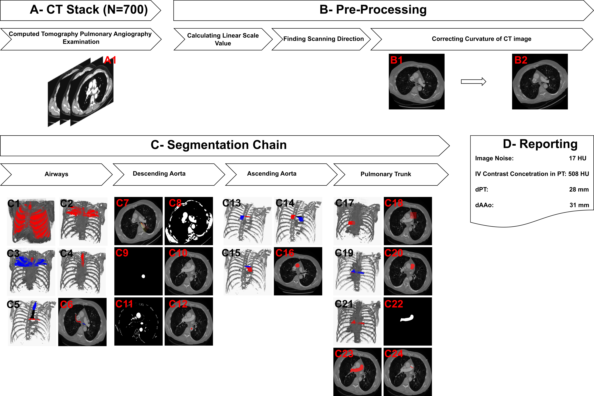
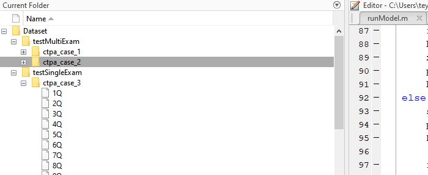
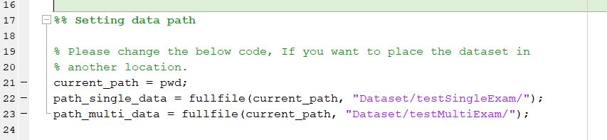

# Automated Detection, Segmentation and Measurement of Major Vessels and the Trachea in CT Pulmonary Angiography
#### A fully automated deterministic approach for mediastinal structures analysis 

## Citing this work
>Please cite the [following paper](https://www.nature.com/articles/s41598-023-45509-1) when using CADe Model:
>
    Kahraman, A.T., Fröding, T., Toumpanakis, D. , Sladoje, N., Sjöblom, T. Automated detection, segmentation and measurement of major vessels and the trachea in CT pulmonary angiography.
    Sci Rep 13, 18407 (2023). https://doi.org/10.1038/s41598-023-45509-1

 

> For more detail, please see our [Patent Cooperation Treaty (pct)](https://patents.google.com/patent/WO2022164374A1) application.

# Table of Contents
- [Abstract](#abstract)
- [CADe model](#cade-model)
- [Usage](#usage)

## Abstract

Mediastinal structure measurements are important for the radiologist’s review of computed tomography pulmonary angiography (CTPA) examinations. In the reporting process, radiologists make measurements of diameters, volumes, and organ densities for image quality assessment and risk stratification. However, manual measurement of these features is time consuming. Here, we sought to develop a time-saving automated algorithm that can accurately detect, segment and measure mediastinal structures in routine clinical CTPA examinations. In this study, **700** CTPA examinations collected and annotated. Of these, a training set of **180** examinations were used to develop a fully automated deterministic algorithm. On the test set of **520** examinations, two radiologists validated the detection and segmentation performance quantitatively, and ground truth was annotated to validate the measurement performance. External validation was performed in **47** CTPAs from two independent datasets. The system had **86%-100%** detection and segmentation accuracy in the different tasks. The automatic measurements correlated well to those of the radiologist **(Pearson's r 0.68-0.99)**. Taken together, the fully automated algorithm accurately detected, segmented, and measured mediastinal structures in routine CTPA examinations having an adequate representation of common artifacts and medical conditions.

## CADe Model

**Figure 1. Flowchart of the CADe algorithm.** **(A)** A total of 700 2 mm axial CTPA image stacks were exported from the PACS server. **(B)** In the pre-processing, the linear scale value and the curvature of the CT image were calculated. **(C)** The segmentation chain consisted of four steps, starting with trachea detection followed by DAo, AAo, and PT detection. **(D)** Noise assessment and measurements of mediastinal vascular structures were reported by the system.

## Usage

> For minimum requirements please check "dependencies.md" file first. 

> This model only accepts the DICOM file format and can only run on a CT pulmonary angiogram (CTPA) examinations. 

> You have to configure the directory structure correctly to be able to run the model. 

#### Step 1: Code Downloading

Please download the whole directory to your local work station.

#### Step 2: Configuration of Directory Structure

***Default Configuration***

Please put your CTPA examinations under the "Dataset/testMultiExam"  or  "Dataset/testSingleExam" directory. Your directory structure should be as shown in the image below.

> If you want to test more than one CTPAs, please put your data under the "Dataset/testMultiExam" folder. 

> If you want to test a single case, please put your data under the"Dataset/testSingleExam" folder.

***Optional Configuration***

If you want to place or your dataset is placed in another location, please modify the code in line number 22 and 23 in "runModel.m" file as shown in the image below.

#### Step 3: Running the Model

After the configuration of the directory structure, you just need to run the "runModel.m" file. Measurements will be saved in txt file under the "Results" folder. And the model results will be illustrated in images on pop-up windows.
